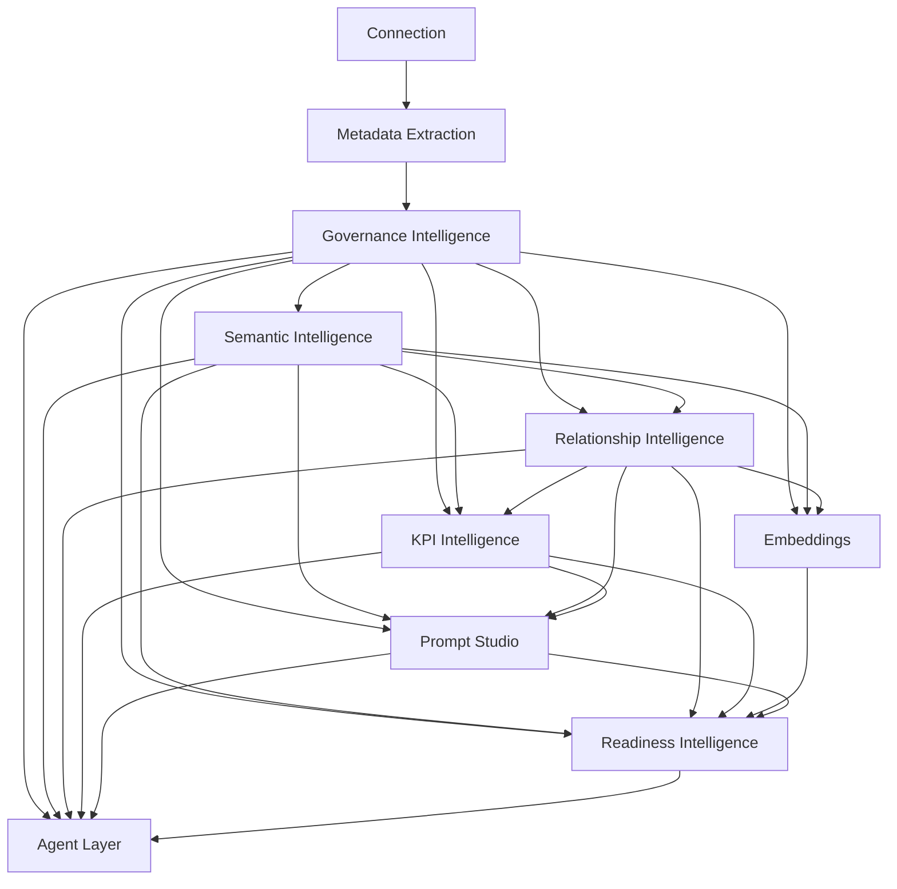

# Architecture Stabilization Report

## Executive Summary

This repository already contains the pieces of an AI-native metadata intelligence platform, but the runtime path is still fragile because contracts drift across prompts, ORM models, migrations, API schemas, and downstream consumers.

The core pattern is consistent:

- metadata is collected correctly
- AI calls are made through a centralized Azure OpenAI wrapper
- outputs are persisted in several places
- downstream stages often still expect legacy aliases or broader payloads

The main architectural issue is not one broken module. It is that the platform is still behaving like several overlapping systems:

- raw metadata pipeline
- governance/semantic/relationship AI pipeline
- prompt-studio artifact generator
- readiness and KPI summarizers

These systems share data, but they do not yet share a single canonical package contract end-to-end.

The highest-confidence stabilization work is:

1. Keep one canonical package per AI stage.
2. Make downstream stages consume persisted packages instead of raw schema when packages exist.
3. Remove contract drift between prompts, services, and response schemas.
4. Keep the Azure wrapper as the single AI boundary and make its response handling deterministic.
5. Align migrations with the ORM state and remove old assumptions from prompt templates.

## Architecture Gap Report

### What is already solid

- Metadata ingestion and persistence are working.
- The AI observability wrapper is centralized and already captures request/response metadata.
- Governance, semantic, and relationship packages exist in the ORM.
- Relationship clustering already supports batching and cluster telemetry.
- The package registry already exposes which product areas are enabled.

### What is still unstable

- Prompt contracts still drift between canonical package shape and legacy aliases.
- Several prompt templates still reference `business_entity_graph` while the target relationship contract uses `entity_graph`.
- Some downstream code still expects legacy structures instead of persisted packages.
- GPT-5 Nano requests were previously constrained too tightly and some stages still use stage-specific budgets rather than a shared package-first contract.
- AI services still mix prompt shaping, model calls, validation, normalization, and persistence in the same method.
- Readiness and Prompt Studio still synthesize from mixed sources instead of only consuming the latest stored packages.

### Production risks

- Empty responses can still be treated as ordinary failures instead of stage-level package failures.
- Large prompt payloads can still exceed practical completion budgets.
- Legacy compatibility fields can leak into the runtime contract and mask regressions.
- A mismatch between prompt output and validator requirements can halt a stage at runtime.

## Dependency Graph

## Package Contracts

### Metadata Package

Current responsibility:
- collect schemas, tables, columns, and relationships

Intended responsibility:
- persist normalized physical metadata and serve as the seed for AI stages

Inputs:
- connection credentials
- database catalog/introspection

Outputs:
- connected database
- schemas
- tables
- columns
- foreign-key relationships

Persisted artifacts:
- `connected_databases`
- `database_schemas`
- `database_tables`
- `database_columns`
- `database_relationships`

Downstream consumers:
- governance
- semantics
- relationships
- KPI
- embeddings
- prompt studio
- readiness

Violations / drift:
- downstream stages still sometimes rebuild from raw metadata instead of persisted intelligence packages

### Governance Package

Canonical package:
- `governance_packages`

Current responsibility:
- classify columns for PII, sensitivity, risk, and business meaning

Intended responsibility:
- produce a reusable table-level governance package and table-level column semantics

Inputs:
- table metadata
- column metadata
- optional semantic context

Outputs:
- `table_summary`
- `business_purpose`
- `resolved_columns[]`
- risk and PII classification for each column

Persisted artifacts:
- `column_semantics`
- `governance_packages`

Upstream dependencies:
- metadata

Downstream dependencies:
- semantics
- relationships
- KPI
- embeddings
- prompt studio
- readiness
- agents

Violations / drift:
- prompt templates and code must stay aligned on the compact table-level contract
- governance should not depend on rulebooks or database-wide payloads once metadata is sufficient

### Semantic Package

Canonical package:
- `semantic_packages`
- `table_semantic_packages`

Current responsibility:
- infer business domain, entities, processes, capabilities, and glossary

Intended responsibility:
- turn governance + metadata into a stable business understanding layer

Inputs:
- governance package
- table metadata

Outputs:
- `business_domain`
- `semantic_summary`
- `business_entities[]`
- `business_processes[]`
- `business_capabilities[]`
- `business_glossary[]`

Persisted artifacts:
- `database_semantics`
- `schema_semantics`
- `semantic_packages`
- `table_semantic_packages`

Upstream dependencies:
- governance package

Downstream dependencies:
- relationships
- KPI
- embeddings
- prompt studio
- readiness
- agents

Violations / drift:
- some prompt templates still expect broader legacy fields instead of the canonical semantic package

### Relationship Package

Canonical package:
- `relationship_packages`

Current responsibility:
- cluster physical relationships and infer business relationships

Intended responsibility:
- reason over governance + semantic + graph metadata to produce business relationship intelligence

Inputs:
- governance package
- semantic package
- physical relationship graph

Outputs:
- `cluster_summary`
- `cluster_confidence`
- `entity_graph[]`
- `hidden_relationships[]`
- `business_process_flows[]`
- `upstream_dependencies[]`
- `downstream_dependencies[]`
- `lifecycle_flows[]`

Persisted artifacts:
- `schema_relationship_graph`
- `relationship_packages`
- `relationship_cluster_telemetry`

Upstream dependencies:
- governance package
- semantic package
- metadata graph

Downstream dependencies:
- KPI
- embeddings
- prompt studio
- readiness
- agents

Violations / drift:
- legacy aliases like `business_entity_graph` and `entity_lifecycle_descriptions` still leak into prompt templates and downstream consumers
- validators and prompts are not perfectly aligned on the target contract

### KPI Package

Current responsibility:
- derive KPI candidates from semantic and relationship context

Intended responsibility:
- consume persisted governance, semantic, and relationship packages only

Inputs:
- governance package
- semantic package
- relationship package

Outputs:
- KPI catalog
- KPI definitions
- lineage
- confidence / coverage metrics

Persisted artifacts:
- `kpi_intelligence`
- `kpi_artifacts`

Violations / drift:
- KPI still synthesizes from a mix of persisted packages and live graph-building logic

### Embeddings Package

Current responsibility:
- generate vector assets for metadata and intelligence artifacts

Intended responsibility:
- embed governed semantic and relationship context, not raw dumps

Inputs:
- governance package
- semantic package
- relationship package

Outputs:
- embedding documents
- vectors
- collection manifests

Persisted artifacts:
- embedding tables / qdrant collections

Violations / drift:
- embeddings still depend on context built from mixed layers rather than a single canonical intelligence package

### Prompt Studio Package

Current responsibility:
- render context artifacts for downstream assistants

Intended responsibility:
- consume persisted packages and render versioned artifacts deterministically

Inputs:
- governance package
- semantic package
- relationship package
- KPI package
- readiness signals

Outputs:
- `database_context`
- `system_prompt`
- `rag_context`
- `agent_context`
- `text_to_sql_context`

Persisted artifacts:
- `ArtifactManifest`

Violations / drift:
- prompt templates still reference legacy relationship aliases
- prompt studio still builds context from a blend of latest packages and raw metadata

### Readiness Package

Current responsibility:
- score readiness and summarize gaps

Intended responsibility:
- assess the health of the entire intelligence pipeline from persisted artifacts

Inputs:
- governance package
- semantic package
- relationship package
- KPI package
- embeddings
- prompt artifacts

Outputs:
- readiness status
- category scores
- remediation hints
- AI narrative

Persisted artifacts:
- `readiness_snapshots`

Violations / drift:
- readiness still computes from live counts and mixed sources instead of a strict package graph

### Agent Package

Current responsibility:
- expose orchestrated governed context for agent workflows

Intended responsibility:
- consume only the latest persisted intelligence packages

Inputs:
- governance package
- semantic package
- relationship package
- KPI package
- readiness package

Outputs:
- agent context
- escalation rules
- workflow definitions

Persisted artifacts:
- prompt artifacts
- agent context documents

Violations / drift:
- the agent layer is still more of a prompt artifact consumer than a true package consumer

## Module Review

### `app/services/sync_service.py`

Current responsibility:
- metadata discovery and persistence
- sequential invocation of semantic, governance, and relationship stages

Intended responsibility:
- finish metadata commit first, then hand off to package-producing services

Inputs:
- connected database
- connector introspection result

Outputs:
- persisted schemas, tables, columns, and relationships
- stage execution

Persisted artifacts:
- metadata tables
- sync log

Upstream dependencies:
- connector layer

Downstream dependencies:
- semantic service
- governance service
- relationship engine

Contract violations:
- orchestration is still tied to direct service calls rather than a clean package handoff

### `app/services/column_semantic_service.py`

Current responsibility:
- table-level governance classification
- column semantic persistence
- governance package persistence

Intended responsibility:
- own governance intelligence and publish a stable governance package

Inputs:
- table metadata
- optional semantic package

Outputs:
- column semantic rows
- governance package rows

Persisted artifacts:
- `column_semantics`
- `governance_packages`

Upstream dependencies:
- metadata
- semantic package when present

Downstream dependencies:
- semantic service
- relationship engine
- prompt studio
- readiness

Contract violations:
- prompt shaping, AI call, parsing, and persistence are still combined in one flow
- the stage still has to bridge old and new governance expectations

### `app/services/database_semantic_service.py`

Current responsibility:
- database-level semantic reasoning
- table semantic persistence
- semantic package persistence

Intended responsibility:
- consume governance packages and emit a stable semantic package

Inputs:
- metadata package
- governance package

Outputs:
- `database_semantics`
- `semantic_packages`
- `schema_semantics`

Persisted artifacts:
- semantic rows and packages

Upstream dependencies:
- governance package
- metadata

Downstream dependencies:
- relationship engine
- KPI
- prompt studio
- readiness

Contract violations:
- still constructs the prompt context from raw metadata plus governance package
- semantic prompt and runtime contract must stay aligned

### `app/schema_engine/relationship_graph.py`

Current responsibility:
- physical graph construction
- cluster splitting
- relationship intelligence synthesis
- package persistence

Intended responsibility:
- consume governance and semantic packages plus physical graph data
- emit stable relationship packages without legacy alias drift

Inputs:
- governance package
- semantic package
- relationship graph metadata

Outputs:
- relationship package
- relationship telemetry
- graph snapshot

Persisted artifacts:
- `schema_relationship_graph`
- `relationship_packages`
- `relationship_cluster_telemetry`

Upstream dependencies:
- metadata graph
- governance package
- semantic package

Downstream dependencies:
- KPI
- prompt studio
- readiness
- agents

Contract violations:
- still exposes legacy aliases to keep older consumers working
- prompt contract and storage contract are not perfectly identical yet

### `app/services/kpi_intelligence_service.py`

Current responsibility:
- KPI discovery and storage

Intended responsibility:
- consume only persisted governance, semantic, and relationship packages

Inputs:
- governance package
- semantic package
- relationship package

Outputs:
- KPI records
- KPI artifacts

Persisted artifacts:
- `kpi_intelligence`
- `kpi_artifacts`

Contract violations:
- still rebuilds relationship context during execution
- still uses a large direct AI prompt budget

### `app/services/prompt_studio_service.py`

Current responsibility:
- render prompt artifacts from the current intelligence context

Intended responsibility:
- render artifacts from persisted packages and registry-approved templates only

Inputs:
- metadata
- governance package
- semantic package
- relationship package
- readiness
- embeddings

Outputs:
- prompt artifacts
- artifact manifests

Persisted artifacts:
- `artifact_manifests`

Contract violations:
- prompt context still contains legacy relationship aliases
- context assembly still blends raw and persisted sources

### `app/services/readiness_service.py`

Current responsibility:
- compute readiness scores and AI narratives

Intended responsibility:
- become the top-level scorecard over all persisted packages

Inputs:
- governance package
- semantic package
- relationship package
- KPI package
- embeddings
- prompt artifacts

Outputs:
- readiness snapshot

Persisted artifacts:
- `readiness_snapshots`

Contract violations:
- readiness still reads a lot of live counts and mixed evidence

### `app/services/ai_observability_service.py`

Current responsibility:
- central Azure OpenAI wrapper and tracing boundary

Intended responsibility:
- be the only request/response boundary for all AI stages

Inputs:
- model name
- deployment settings
- messages or texts
- request kwargs

Outputs:
- normalized AI observation result

Persisted artifacts:
- traces / run metadata

Contract violations:
- stage services still sometimes use wrapper metadata as a fallback for missing package fields
- observability should remain a boundary, not a business-logic source

## Prompt and Contract Drift

### Confirmed drift

- `system_prompt.yaml`, `database_context.yaml`, `rag_context.yaml`, `agent_context.yaml`, and `text_to_sql.yaml` still reference `relationship_intelligence.business_entity_graph` and `entity_lifecycle_descriptions`.
- The target relationship package contract uses `entity_graph` and `lifecycle_flows`.
- Prompt registry validation requires `constraints`, so every prompt YAML must remain registry-compliant.
- Stage prompts must stay compact and explicit for GPT-5 Nano.

### Alignment status

- Governance prompt contract: mostly aligned with the current compact table-level design.
- Semantic prompt contract: aligned at a high level, but still broader than the final package-first ideal.
- Relationship prompt contract: aligned in shape, but legacy aliases are still tolerated in the runtime path.

## Required Migrations

### Already present and required for the current architecture

- `023_create_relationship_packages.py`
- `024_add_missing_cluster_columns.py`
- `025_add_telemetry_columns.py`

These are required to keep the current ORM and relationship telemetry path deployable.

### Optional future cleanup migrations

- a deprecation migration for legacy relationship aliases in `schema_relationship_graph` if the target contract is fully normalized
- a cleanup migration for any legacy columns or duplicated alias fields that remain only for backward compatibility

### Migration risk summary

- the current repo already contains the storage path needed for the canonical packages
- the main risk is not a missing table, but a mismatch between runtime expectations and the stored shape

## Required Model Changes

### Highest priority

- Standardize all package-facing models on a single canonical vocabulary:
  - governance: `resolved_columns`
  - semantics: `business_domain`, `business_entities`, `business_processes`, `business_capabilities`, `business_glossary`
  - relationships: `entity_graph`, `hidden_relationships`, `business_process_flows`, `upstream_dependencies`, `downstream_dependencies`, `lifecycle_flows`

### Recommended cleanup

- keep legacy aliases only at the API compatibility layer, not inside new prompt contracts
- minimize `execution_status` / `analysis_status` duplication to one canonical field per stage package

## Required Prompt Changes

### Governance

- keep the prompt table-level and compact
- do not reintroduce rulebooks, taxonomies, or policy payloads

### Semantics

- make the prompt consume governance package + compact metadata only
- keep output compact and package-shaped

### Relationships

- remove legacy alias names from the prompt output contract
- keep the prompt focused on cluster reasoning, hidden relationships, and lineage

### Prompt Studio / system prompts

- update prompt templates to consume the canonical relationship package fields
- remove direct reliance on `business_entity_graph` in the target contract

## Required Persistence Changes

- persist each stage output before downstream consumption
- keep `trace_id` stored as string at every ORM boundary
- store raw failure reasons for empty or truncated AI outputs
- keep package rows as the primary downstream source

## Required API Changes

- governance package endpoints should surface the stored governance package directly
- semantic endpoints should surface the stored semantic package directly
- relationship endpoints should surface the stored relationship package directly
- readiness endpoints should hydrate from package rows, not recompute ad hoc contracts

## Required UI Changes

- governance UI should show governance package status, not just column-level rows
- semantic UI should show the business domain/package summary as first-class data
- relationship UI should show cluster summaries, package confidence, and hidden relationships
- prompt studio UI should preview generated artifacts from persisted packages
- readiness UI should show package coverage and stage health

## Prioritized Implementation Plan

### 1. Contract stabilization

- pick one canonical output contract per stage
- remove prompt and schema drift
- keep legacy aliases only where the public API still needs them

### 2. Persistence alignment

- ensure every package is persisted successfully before the next stage runs
- normalize `trace_id` and failure metadata
- keep package tables as the authoritative downstream source

### 3. Prompt simplification

- keep prompts compact and stage-specific
- remove legacy / broad metadata from AI requests
- keep prompts registry-compliant

### 4. AI wrapper hardening

- keep Azure OpenAI request logging and raw response capture centralized
- treat empty or truncated responses as explicit failures with stored reasons

### 5. UI / API cleanup

- expose package-first endpoints
- reduce direct dependence on raw metadata in UI flows

## Recommended Target State

The repository should converge to this rule:

- metadata is collected once
- governance reasons over metadata and stores a governance package
- semantics consumes the governance package and stores a semantic package
- relationships consumes governance + semantic packages and stores a relationship package
- KPI, embeddings, prompt studio, readiness, and agents consume only the persisted packages

That is the deterministic AI intelligence pipeline the platform is aiming for.
